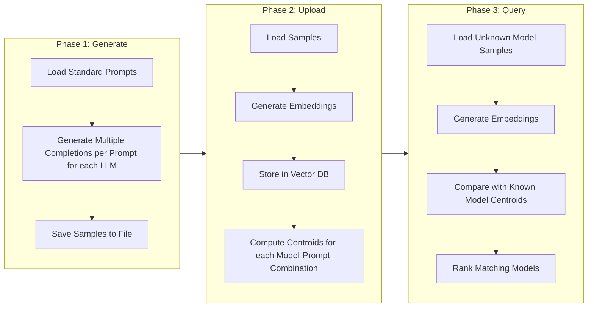
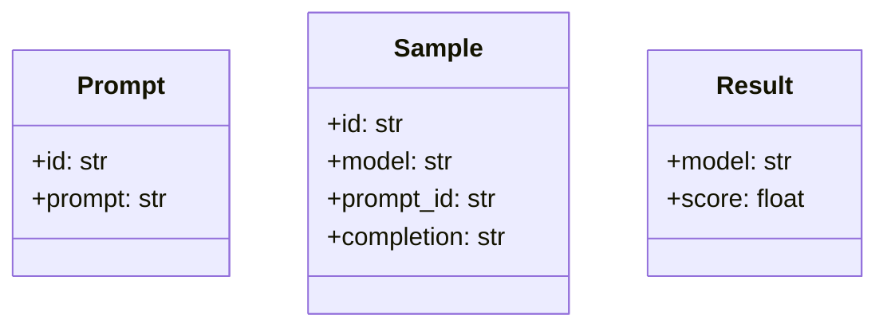
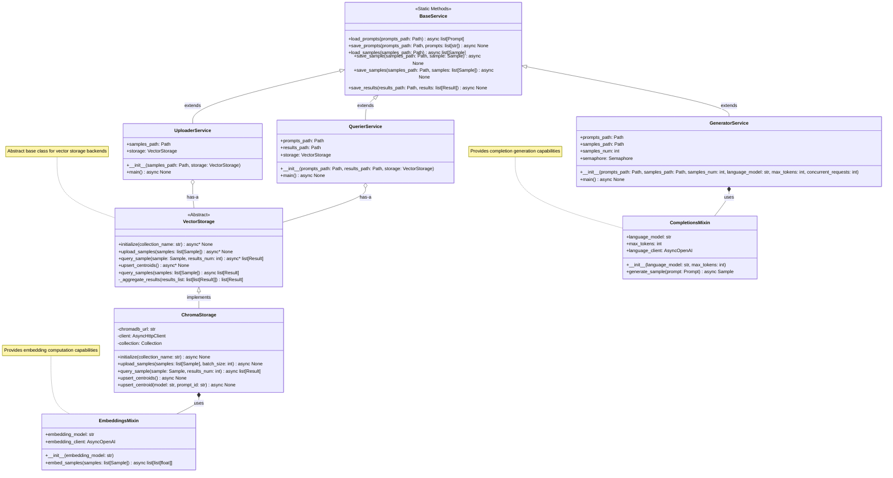
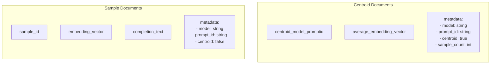
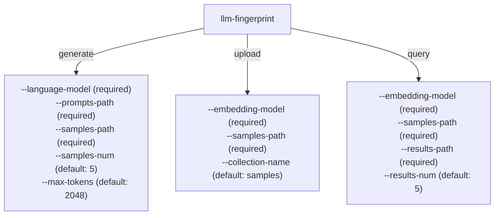
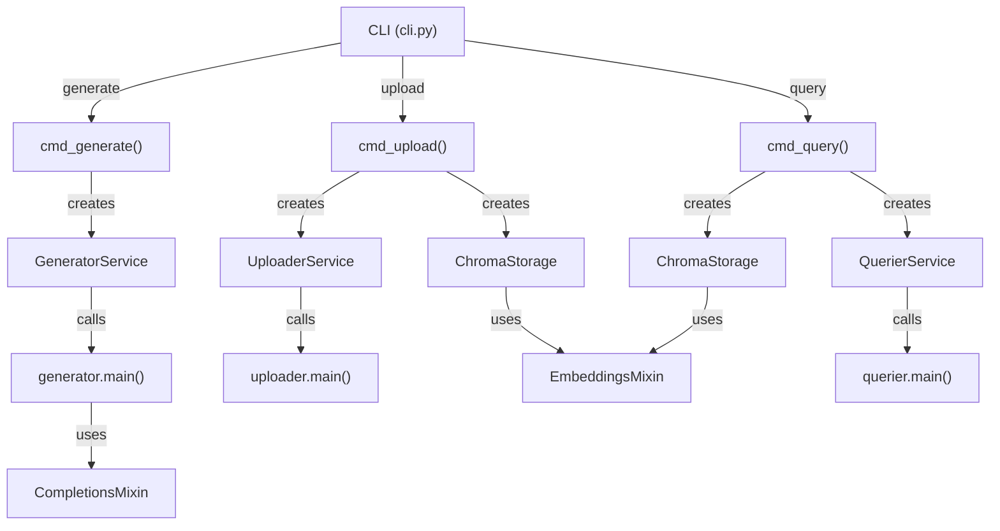

# Contributing

Welcome to the LLM Fingerprinting project! This project aims to develop methods for identifying language models based on their response patterns. We appreciate your interest in contributing.

This document provides guidelines and instructions for contributing to the project. Whether you're fixing bugs, improving documentation, or proposing new features, your contributions are welcome.

## How to Contribute

1. **Report Issues**: If you find bugs or have feature requests, please create an issue on GitHub.

2. **Submit Pull Requests**: For code contributions, fork the repository, make your changes, and submit a pull request.

3. **Follow Coding Standards**: We use Ruff for linting and formatting, and pyright/basedpyright for type checking. Make sure your code passes all checks.

4. **Write Tests**: For new features or bug fixes, please include tests to validate your changes.

5. **Use Conventional Commits**: Follow the conventional commits specification for your commit messages.

## Environment Setup

This section describes how to set up the **recommended** development environment for this project [uv](https://docs.astral.sh/uv/).

1. Download the repository:

```sh
git clone https://github.com/S1M0N38/llm-fingerprint.git
cd llm-fingerprint
```

2. Create environment:

```sh
uv venv
uv sync --group dev
```

3. Set up environment variables:

```sh
cp .envrc.example .envrc
# And modify the .envrc file
```

The environment setup is now ready to use. Every time you are working on the project, you can activate the environment by running:

```sh
source .envrc
```

> You can use [direnv](https://github.com/direnv/direnv) to automatically activate the environment when you enter the project directory.

## Project Structure

### Files and Directories

The following diagram shows the main files and directories in the project. This structure helps understand how the code is organized and where to find specific functionality.

```
llm-fingerprint/
│
├── config/
│   └── llama-cpp.yaml
│
├── data/
│   ├── chroma/                  # ChromaDB storage directory
│   ├── prompts/                 # Prompt files directory
│   └── samples/                 # Generated samples directory
│
├── src/
│   └── llm_fingerprint/
│       ├── __init__.py
│       ├── cli.py               # Command-line interface
│       ├── mixin.py             # Completion and Embedding mixins
│       ├── models.py            # Pydantic data models
│       ├── services.py          # Service layer (Generator, Uploader, Querier)
│       └── storage/
│           ├── __init__.py
│           ├── base.py          # Abstract VectorStorage class
│           └── implementation/
│               ├── __init__.py
│               ├── chroma.py    # ChromaDB implementation
│               └── qdrant.py    # Qdrant implementation (placeholder)
│
├── .envrc.example               # Environment variables template
├── CHANGELOG.md                 # Project changelog
├── CONTRIBUTING.md              # Contribution guidelines
├── README.md                    # Project documentation
├── justfile                     # Command runner configuration
├── pyproject.toml               # Python project configuration
└── uv.lock                      # Dependencies lock file
```

### Project Phases

The diagram below illustrates the three main phases of the LLM fingerprinting process and how they connect. Understanding this workflow is essential for contributing to any part of the system.



### Data Models

The system uses three main data models to represent the data flowing through the system. These Pydantic models define the structure of prompts, samples, and query results.



### Core Classes

This diagram shows the main classes in the system and their relationships. The architecture follows a layered approach with storage abstractions, mixins for specific capabilities, and services that orchestrate the operations.



### Storage Schema

This diagram represents how data is organized in the vector database. The system stores both individual sample documents and computed centroids that represent the average embeddings for a specific model-prompt combination. Both documents are stored in the same collection.



### CLI Commands

This diagram shows the command-line interface structure, including the three main commands (generate, upload, query) and their respective parameters. The CLI is the primary way users interact with the system.



### Command Flow (CLI)

This diagram illustrates how the CLI commands flow through the system, from the initial command parsing to the service execution. It shows how the different components connect and interact.


